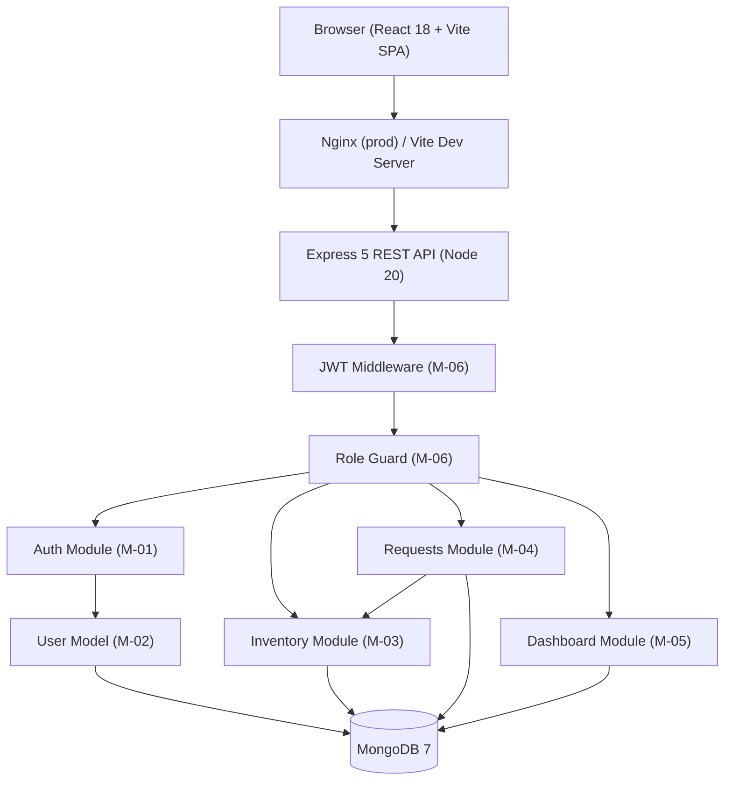
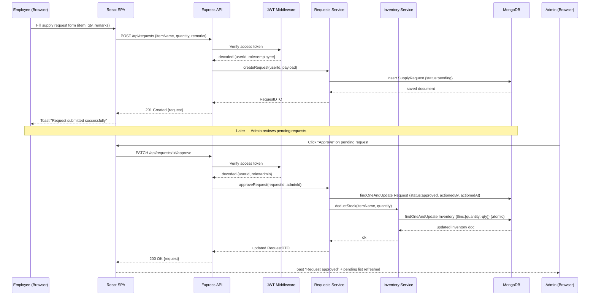
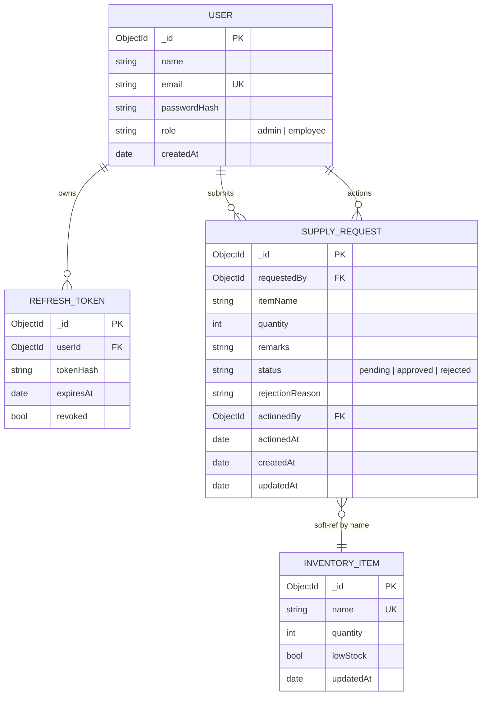
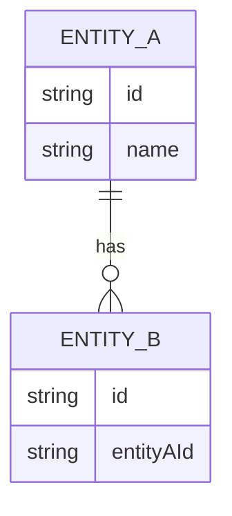

# Architecture — Office Supply Management System (CHG-01)

## Overview

Three-tier web application (updated per CHG-01):
- **Frontend**: React 18 + Vite 5 SPA (TypeScript, React Hook Form + Zod, Zustand, React Router v6, Axios, react-hot-toast)
- **Backend**: Node.js 20 + Express 5 REST API (TypeScript, Mongoose, express-validator, helmet, cors)
- **Database**: MongoDB 7 (Mongoose ODM, atomic `$inc` for inventory deduction)
- **Auth**: JWT HS256 — short-lived access token (15 min, Authorization header) + refresh token (7 days, HttpOnly cookie)
- **Containerisation**: Docker + docker-compose (client service, server service, mongo service)

The Office Supply Management System is a browser-based web application that allows employees to submit supply requests and admins to manage inventory and approve or reject those requests. The system is built as a single-page React frontend (Vite) communicating with a Node.js/Express REST API backed by a MongoDB database, secured with JWT authentication, and packaged for deployment with Docker.

---

## Module Breakdown

| Module ID | Name | Description | Key files | Depends on | Complexity |
|-----------|------|-------------|-----------|------------|------------|
| M-01 | Backend – Auth | Register, login, refresh-token, logout; JWT issue/verify | `server/src/modules/auth/` | M-02, M-06 | Medium |
| M-02 | Backend – Users | User Mongoose model, seed script | `server/src/modules/user/` | MongoDB | Low |
| M-03 | Backend – Inventory | Inventory CRUD routes + model + low-stock logic | `server/src/modules/inventory/` | M-02, M-06 | Medium |
| M-04 | Backend – Requests | Submit, approve (atomic), reject, list, search/filter | `server/src/modules/requests/` | M-02, M-03, M-06 | High |
| M-05 | Backend – Dashboard | Aggregated stats via MongoDB `$group` pipeline | `server/src/modules/dashboard/` | M-03, M-04 | Low |
| M-06 | Backend – Middleware | authenticate (JWT), requireRole, errorHandler, logger | `server/src/middleware/` | M-01 | Low |
| M-07 | Frontend – Auth | Login/Register pages, AuthContext, ProtectedRoute, token refresh interceptor | `client/src/pages/Login.tsx`, `client/src/pages/Register.tsx`, `client/src/context/AuthContext.tsx` | — | Medium |
| M-08 | Frontend – Employee | NewRequest form, MyRequests history, EmployeeDashboard | `client/src/pages/employee/` | M-07 | Medium |
| M-09 | Frontend – Admin | AdminDashboard, Inventory CRUD, PendingRequests, AllRequests | `client/src/pages/admin/` | M-07 | High |
| M-10 | DevOps | Dockerfiles (client + server), docker-compose.yml, .env.example | `docker/`, root | All | Low |

---

## Component Diagram



---

## Sequence Diagram — Primary Happy-Path

Employee submits a supply request → Admin approves → inventory updated atomically.



---

## ER Diagram



> `SUPPLY_REQUEST.itemName` is a soft reference to `INVENTORY_ITEM.name`. On approval, the backend looks up the inventory item by name and creates it (quantity=0) if it does not exist (FR-12).

---

## API Contracts

### Health

| Method | Path | Auth | Response |
|--------|------|------|----------|
| GET | `/api/health` | None | 200 `{ status: "ok" }` |

### Auth (`/api/auth`)

| Method | Path | Auth | Request Body | Response | Status |
|--------|------|------|-------------|----------|--------|
| POST | `/register` | Public | `{ name, email, password }` | `{ user, accessToken }` + Set-Cookie refresh | 201 |
| POST | `/login` | Public | `{ email, password }` | `{ user, accessToken }` + Set-Cookie refresh | 200 |
| POST | `/refresh` | Cookie | — | `{ accessToken }` | 200 |
| POST | `/logout` | Auth | — | — | 204 |

### Inventory (`/api/inventory`)

| Method | Path | Auth | Request Body / Params | Response | Status |
|--------|------|------|-----------------------|----------|--------|
| GET | `/` | Admin | `?page&limit&search` | `{ items[], total }` | 200 |
| POST | `/` | Admin | `{ name, quantity }` | `{ item }` | 201 |
| PATCH | `/:id` | Admin | `{ quantity }` | `{ item }` | 200 |
| DELETE | `/:id` | Admin | — | — | 204 |

### Requests (`/api/requests`)

| Method | Path | Auth | Request Body / Params | Response | Status |
|--------|------|------|-----------------------|----------|--------|
| POST | `/` | Employee | `{ itemName, quantity, remarks? }` | `{ request }` | 201 |
| GET | `/mine` | Employee | `?page&limit&status&search&from&to` | `{ requests[], total }` | 200 |
| GET | `/` | Admin | `?page&limit&status&search&from&to` | `{ requests[], total }` | 200 |
| GET | `/pending` | Admin | `?page&limit` | `{ requests[], total }` | 200 |
| PATCH | `/:id/approve` | Admin | — | `{ request }` | 200 |
| PATCH | `/:id/reject` | Admin | `{ reason? }` | `{ request }` | 200 |

All protected routes → 401 without token. Admin-only routes → 403 for employee role. Approve/reject → 404 if not found; 409 if not pending.

### Dashboard (`/api/dashboard`)

| Method | Path | Auth | Response |
|--------|------|------|----------|
| GET | `/` | Auth | 200 `{ totalRequests, pending, approved, rejected, inventoryCount?, lowStockCount? }` |

---

## Shared Interfaces / Types

```typescript
// server/src/types/index.ts

export interface UserDTO {
  _id: string;
  name: string;
  email: string;
  role: 'admin' | 'employee';
}

export interface InventoryItemDTO {
  _id: string;
  name: string;
  quantity: number;
  lowStock: boolean;
}

export interface RequestDTO {
  _id: string;
  requestedBy: { _id: string; name: string; email: string };
  itemName: string;
  quantity: number;
  remarks?: string;
  status: 'pending' | 'approved' | 'rejected';
  rejectionReason?: string;
  actionedBy?: { _id: string; name: string };
  actionedAt?: string;
  createdAt: string;
  updatedAt: string;
}

export interface DashboardDTO {
  totalRequests: number;
  pending: number;
  approved: number;
  rejected: number;
  inventoryCount?: number;   // admin only
  lowStockCount?: number;    // admin only
}

export interface AuthPayload {  // JWT sub-payload
  id: string;
  name: string;
  email: string;
  role: 'admin' | 'employee';
}
```

---

## Environment Variables

| Variable | Default | Description |
|----------|---------|-------------|
| `MONGODB_URI` | `mongodb://mongo:27017/osms` | MongoDB connection string |
| `JWT_SECRET` | (required) | HS256 access-token secret |
| `JWT_REFRESH_SECRET` | (required) | Refresh token secret |
| `JWT_ACCESS_EXPIRES` | `15m` | Access token TTL |
| `JWT_REFRESH_EXPIRES` | `7d` | Refresh token TTL |
| `CLIENT_ORIGIN` | `http://localhost:5173` | CORS allowed origin |
| `PORT` | `3001` | Express listen port |
| `LOW_STOCK_THRESHOLD` | `5` | Units below which item flagged low-stock |
| `BCRYPT_ROUNDS` | `12` | bcrypt cost factor |
| `SEED_ADMIN_EMAIL` | `admin@company.com` | Seeded admin email |
| `SEED_ADMIN_PASSWORD` | `Admin@12345` | Seeded admin password |

---

## File / Folder Structure

```
office-supply-ms/
├── client/                         # React 18 + Vite 5 frontend
│   ├── src/
│   │   ├── api/                    # Axios instance + per-resource API fns
│   │   ├── components/             # Shared UI (Navbar, ProtectedRoute, StatusBadge…)
│   │   ├── pages/
│   │   │   ├── Login.tsx
│   │   │   ├── Register.tsx
│   │   │   ├── employee/           # Dashboard, NewRequest, MyRequests
│   │   │   └── admin/              # Dashboard, Inventory, PendingRequests, AllRequests
│   │   ├── store/                  # Zustand (auth store)
│   │   ├── hooks/                  # useAuth, useToast
│   │   └── main.tsx
│   ├── index.html
│   ├── vite.config.ts
│   └── package.json
├── server/                         # Node.js 20 + Express 5 backend
│   ├── src/
│   │   ├── config/                 # db.ts (Mongoose connect), env.ts
│   │   ├── middleware/             # authenticate.ts, requireRole.ts, errorHandler.ts
│   │   ├── modules/
│   │   │   ├── auth/               # router.ts, controller.ts, service.ts, token.util.ts
│   │   │   ├── user/               # model.ts, seed.ts
│   │   │   ├── inventory/          # router.ts, controller.ts, service.ts, model.ts
│   │   │   ├── requests/           # router.ts, controller.ts, service.ts, model.ts
│   │   │   └── dashboard/          # router.ts, controller.ts, service.ts
│   │   ├── types/                  # index.ts (shared DTOs + JWT payload)
│   │   └── app.ts                  # Express app assembly
│   ├── tests/                      # Vitest unit + supertest integration tests
│   ├── server.ts                   # Entry point
│   ├── tsconfig.json
│   └── package.json
├── docker/
│   ├── client.Dockerfile
│   └── server.Dockerfile
├── docker-compose.yml
└── .env.example
```

---

## Security Design

- **Passwords**: bcrypt cost 12; never returned in API responses.
- **JWT access tokens**: HS256, 15 min TTL, sent in `Authorization: Bearer` header.
- **Refresh tokens**: HS256, 7 day TTL, stored as HttpOnly + Secure cookie; token hash stored in MongoDB for revocation.
- **Role enforcement**: `requireRole('admin')` middleware → 403 for non-admin callers.
- **Input validation**: express-validator on all POST/PATCH routes; Zod on frontend forms.
- **CORS**: restricted to `CLIENT_ORIGIN` env var via `cors` package.
- **HTTP headers**: `helmet` applied globally (CSP, HSTS, X-Frame-Options, etc.).
- **MongoDB injection**: Mongoose + parameterised queries; no raw `$where` or string-interpolated queries.
- **Concurrency safety**: inventory deduction uses `findOneAndUpdate` with `$inc` — atomic at MongoDB document level (AC-14).

## Test Strategy

| Scope | Tool | Coverage target |
|-------|------|----------------|
| Unit – model functions | Jest | User creation, bcrypt hash check (AC-10) |
| Integration – API routes | Jest + Supertest | All ACs (AC-01 through AC-09) |
| Frontend component | React Testing Library | Login form, RequestForm, MyRequests |
| E2E smoke | docker-compose + curl | AC-11 |

---

## CI/CD and Deployment Considerations

- **Docker**: Multi-stage Dockerfile — stage 1 builds the Vite frontend; stage 2 copies the dist into the Express `public/` folder and runs the Node server on port 3001.
- **docker-compose**: Single service; SQLite data directory mounted as a named volume so data persists across container restarts.
- **Environment**: `JWT_SECRET` must be set in the environment or via an `.env` file. The compose file references it as `${JWT_SECRET}`.
- **Health check**: `GET /api/health` is used by docker-compose and smoke tests to confirm the service is running.

---

## Risks and Mitigations

| Risk | Mitigation |
|------|-----------|
| SQLite concurrent writes under load | Acceptable for ≤200 users; WAL mode enabled on DB init |
| JWT secret leaked | Document secret rotation; never log tokens |
| Inventory item mismatch by name | Normalise item names to lowercase-trimmed strings in model layer |
| Request approved with 0 stock | Floor quantity at 0 on deduction (FR-12) |

---

## Delivery Plan (module implementation order)

1. **M-08** — DB schema (foundation for all models)
2. **M-02** — User model + seed script
3. **M-01** — Auth routes + JWT middleware
4. **M-03** — Inventory routes + model
5. **M-04** — Requests routes + model (depends on M-03 for approval logic)
6. **M-05** — Frontend auth (Login, AuthContext, ProtectedRoute)
7. **M-06** — Frontend employee pages
8. **M-07** — Frontend admin pages
9. **M-09** — Dockerfile + docker-compose
```

## ER Diagram — Data Model



## API Contracts

## Shared Interfaces / Types

## Test Strategy

## CI/CD And Deployment Considerations

## Security Considerations

## Rollback Strategy

## Risks And Mitigations

## Delivery Plan
