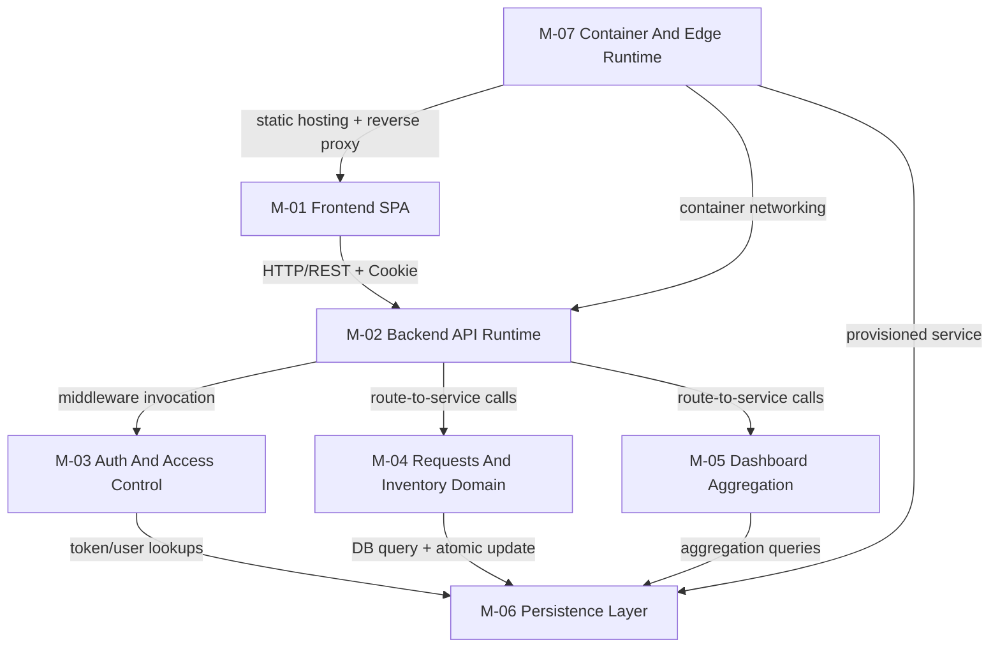
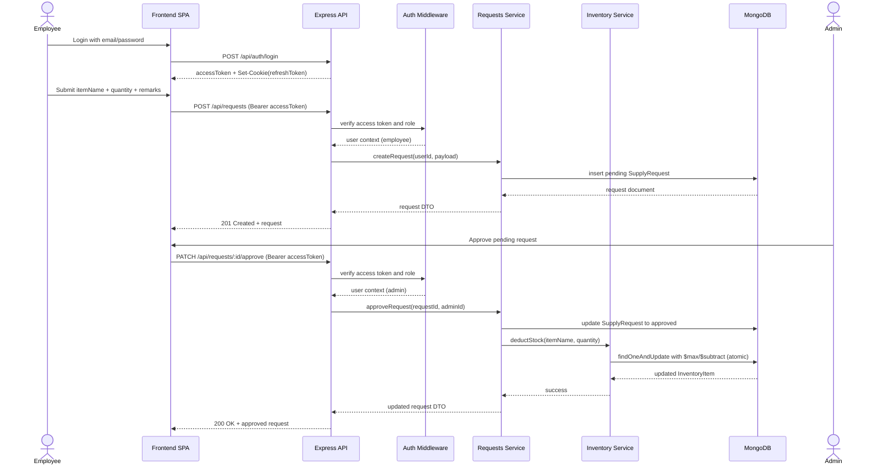
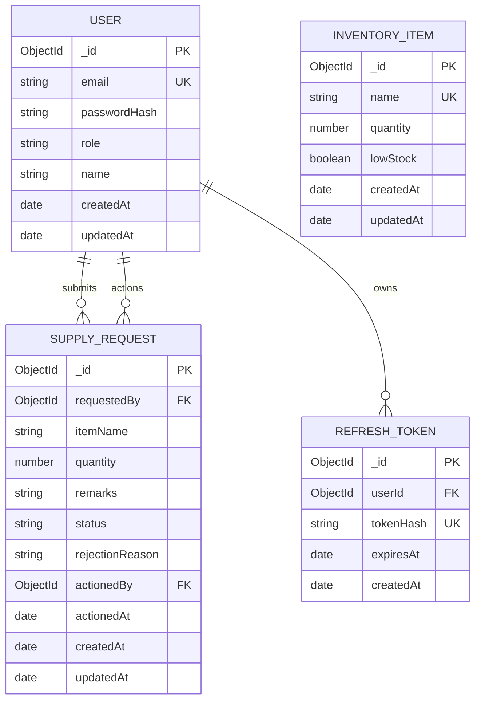
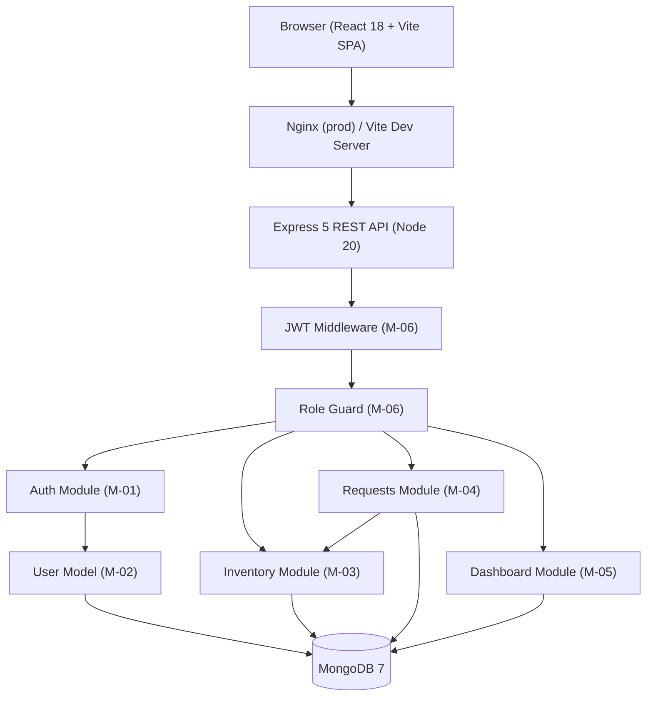
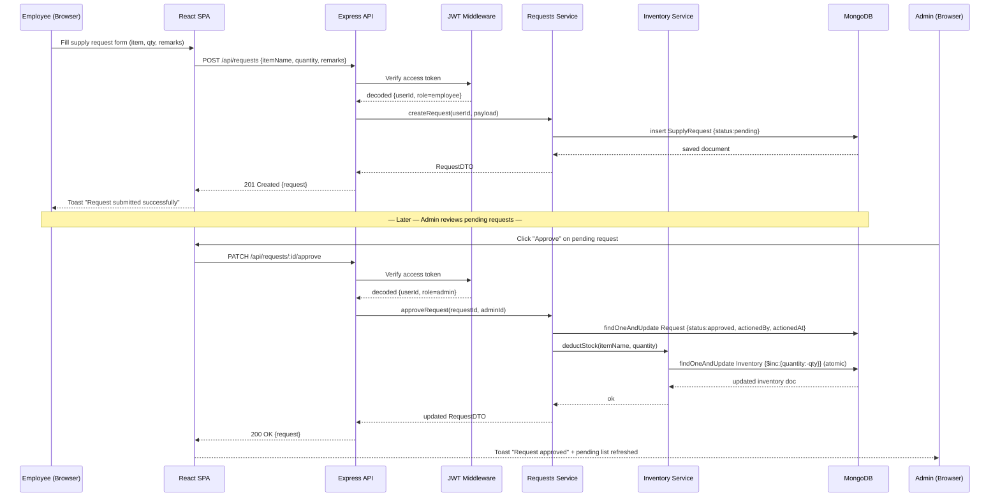
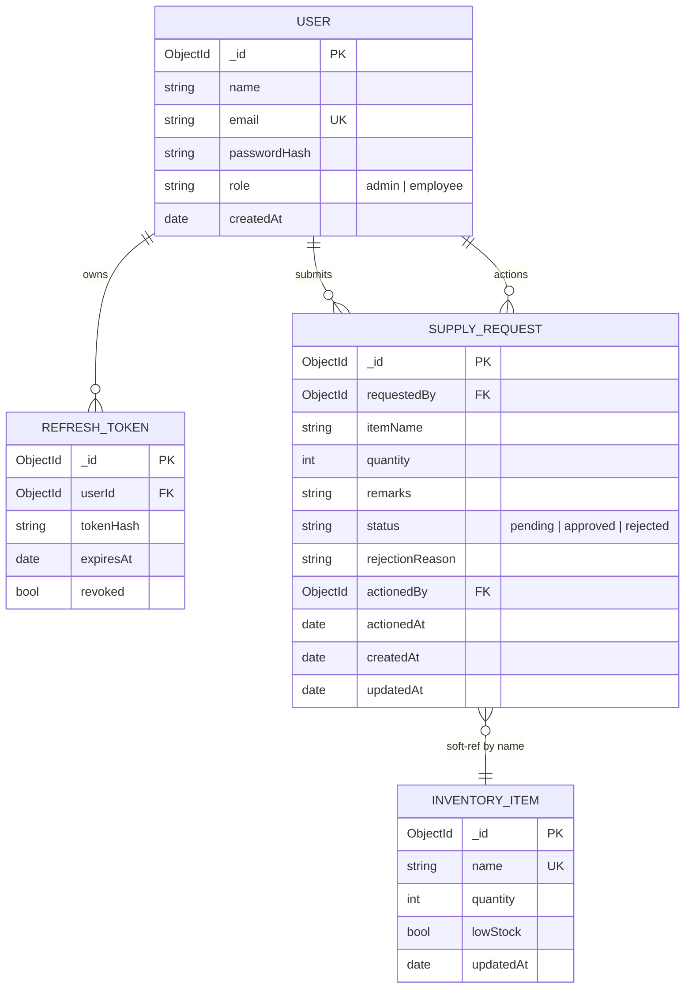
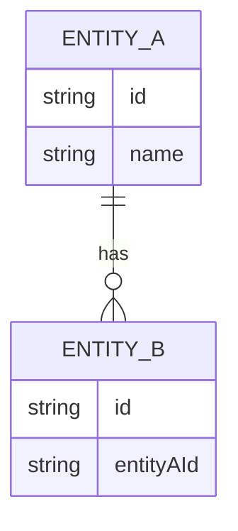

# Architecture - Office Supply Management System (CHG-01)

## Design Goals And Rationale
- Align exactly with [docs/01-requirements.md](docs/01-requirements.md): React 18 + Vite 5 frontend, Express 5 backend, MongoDB 7 with Mongoose, JWT access + refresh-token cookie flow.
- Keep concurrency-safe request approval and stock deduction through MongoDB atomic updates.
- Preserve clear role boundaries: employee request submission/history and admin inventory + request governance.
- Support Docker-based local staging with separate client/server/mongo services.
- Keep architecture modular so coding and testing can proceed module-by-module.

## Proposed System Design
The system is a three-tier web application:

- Presentation tier: React SPA served by Vite in development and Nginx in containerized staging.
- Application tier: Express REST API with feature modules for auth, inventory, requests, and dashboard.
- Data tier: MongoDB with Mongoose schemas for users, inventory items, requests, and refresh tokens.
Authentication uses short-lived access tokens in the Authorization header and long-lived refresh tokens in an HttpOnly cookie. Authorization is enforced at middleware level with role checks.

## Module Breakdown
| Module ID | Name | Description | Key files | Depends on | Complexity |
|-----------|------|-------------|-----------|------------|------------|
| M-01 | Frontend SPA | Browser UI shell, routing, notifications, and feature pages for employee/admin flows | office-supply-ms/client/src/main.tsx; office-supply-ms/client/src/App.tsx; office-supply-ms/client/src/index.css | M-02, M-07 | High |
| M-02 | Backend API Runtime | Express app wiring, route registration, middleware chain, health endpoint | office-supply-ms/server/src/server.ts; office-supply-ms/server/src/modules/auth/routes.ts; office-supply-ms/server/src/modules/inventory/routes.ts; office-supply-ms/server/src/modules/requests/routes.ts; office-supply-ms/server/src/modules/dashboard/routes.ts | M-03, M-04, M-05, M-06 | Medium |
| M-03 | Auth And Access Control | Register/login/refresh/logout, refresh-token persistence, JWT verification, RBAC guards | office-supply-ms/server/src/modules/auth/controller.ts; office-supply-ms/server/src/modules/auth/service.ts; office-supply-ms/server/src/modules/auth/tokenModel.ts; office-supply-ms/server/src/modules/middleware/authenticate.ts; office-supply-ms/server/src/modules/middleware/requireRole.ts | M-06 | Medium |
| M-04 | Requests And Inventory Domain | Request lifecycle, admin approvals/rejections, inventory CRUD, atomic stock deduction | office-supply-ms/server/src/modules/requests/service.ts; office-supply-ms/server/src/modules/requests/model.ts; office-supply-ms/server/src/modules/inventory/service.ts; office-supply-ms/server/src/modules/inventory/model.ts | M-03, M-06 | High |
| M-05 | Dashboard Aggregation | Role-aware summary metrics for total/pending/approved/rejected and admin stock stats | office-supply-ms/server/src/modules/dashboard/service.ts; office-supply-ms/server/src/modules/dashboard/controller.ts | M-04, M-06 | Low |
| M-06 | Persistence Layer | Mongoose models, indexes, seed users, schema constraints, low-stock threshold behavior | office-supply-ms/server/src/modules/user/model.ts; office-supply-ms/server/src/modules/user/seed.ts; office-supply-ms/server/src/modules/requests/model.ts; office-supply-ms/server/src/modules/inventory/model.ts; office-supply-ms/server/src/modules/auth/tokenModel.ts | MongoDB 7 | Medium |
| M-07 | Container And Edge Runtime | Multi-service compose topology, image builds, Nginx reverse-proxy and SPA fallback | office-supply-ms/docker-compose.yml; office-supply-ms/docker/server.Dockerfile; office-supply-ms/docker/client.Dockerfile; office-supply-ms/docker/nginx.conf | M-01, M-02, M-06 | Low |
## UML Diagrams

### Component Diagram



### Sequence Diagram (Primary Happy Path)



### ER Diagram



Note: SUPPLY_REQUEST.itemName is a soft reference to INVENTORY_ITEM.name. On approval, inventory is looked up by name and auto-created with quantity 0 when missing (FR-12).

## API Contracts

### Auth API

| Method | Path | Auth | Request Schema | Response Schema |
|--------|------|------|----------------|-----------------|
| POST | /api/auth/register | Public | { name: string, email: email, password: string(min 6) } | 201 { user: UserPublic } |
| POST | /api/auth/login | Public | { email: email, password: string } | 200 { accessToken: string, user: UserPublic } + HttpOnly refresh cookie |
| POST | /api/auth/refresh | Refresh cookie | none | 200 { accessToken: string, user: UserPublic } |
| POST | /api/auth/logout | Bearer token | none | 204 no body + clear refresh cookie |

UserPublic = { _id: string, name: string, email: string, role: "admin" | "employee" }

### Inventory API (Admin Only)

| Method | Path | Auth | Request Schema | Response Schema |
|--------|------|------|----------------|-----------------|
| GET | /api/inventory?page&limit&search | Bearer admin | query params | 200 { items: InventoryItem[], total: number } |
| POST | /api/inventory | Bearer admin | { name: string, quantity: int >= 0 } | 201 { item: InventoryItem } |
| PATCH | /api/inventory/:id | Bearer admin | { quantity: int >= 0 } | 200 { item: InventoryItem } |
| DELETE | /api/inventory/:id | Bearer admin | none | 204 no body |

InventoryItem = { _id: string, name: string, quantity: number, lowStock: boolean, createdAt: string, updatedAt: string }

### Requests API

| Method | Path | Auth | Request Schema | Response Schema |
|--------|------|------|----------------|-----------------|
| POST | /api/requests | Bearer employee | { itemName: string, quantity: int >= 1, remarks?: string } | 201 { request: SupplyRequest } |
| GET | /api/requests/mine?page&limit&status&search&from&to | Bearer employee | query params | 200 { requests: SupplyRequest[], total: number } |
| GET | /api/requests/pending?page&limit | Bearer admin | query params | 200 { requests: SupplyRequest[], total: number } |
| GET | /api/requests?page&limit&status&search&from&to | Bearer admin | query params | 200 { requests: SupplyRequest[], total: number } |
| PATCH | /api/requests/:id/approve | Bearer admin | none | 200 { request: SupplyRequest } |
| PATCH | /api/requests/:id/reject | Bearer admin | { reason?: string } | 200 { request: SupplyRequest } |

### Dashboard API

| Method | Path | Auth | Response Schema |
|--------|------|------|-----------------|
| GET | /api/dashboard | Bearer user | 200 { totalRequests, pending, approved, rejected, inventoryCount?, lowStockCount? } |

### Error Contract

- Validation failures: 400 { errors: ValidationError[] }
- Auth failures: 401 { message: string }
- Forbidden role: 403 { message: string }
- Not found: 404 { message: string }
- Conflict (duplicate item, non-pending action): 409 { message: string }
- Unhandled: 500 { message: "Internal Server Error" }

## Shared Interfaces And Ownership

| Interface / Contract | Owning Module | Source Of Truth | Notes |
|----------------------|---------------|-----------------|-------|
| AuthPayload | M-03 | office-supply-ms/server/src/types/index.ts | Runtime JWT claims mapped into req.user |
| UserPublic response shape | M-03 | office-supply-ms/server/src/modules/auth/controller.ts | Returned by register/login/refresh |
| SupplyRequest response shape | M-04 | office-supply-ms/server/src/modules/requests/model.ts + controllers | Includes audit fields actionedBy/actionedAt |
| InventoryItem response shape | M-04 | office-supply-ms/server/src/modules/inventory/model.ts + controller | Includes lowStock computed flag |
| DashboardStats response shape | M-05 | office-supply-ms/server/src/modules/dashboard/service.ts | Role-aware fields |

## Test Strategy

| Module | Unit Scope | Integration Scope | E2E Scope | Acceptance Criteria Focus |
|--------|------------|-------------------|-----------|---------------------------|
| M-03 Auth And Access Control | Password hashing and token utility behavior | /api/auth register/login/refresh/logout and 401/403 middleware behavior | Login flow and protected-route entry | AC-01, AC-12, AC-13 |
| M-04 Requests And Inventory Domain | Approval/rejection edge cases and stock floor logic | /api/requests and /api/inventory including concurrent approve | Employee request submit + admin action happy path | AC-02, AC-03, AC-04, AC-05, AC-06, AC-07, AC-08, AC-10, AC-14 |
| M-05 Dashboard Aggregation | Aggregation math for status buckets | /api/dashboard role-specific payload | Admin and employee dashboard load | AC-09 |
| M-01 Frontend SPA | Form validation and state transitions | API integration contracts with mocked backend | Toast visibility and history rendering | AC-11 |

Quality gates:

- Keep service-heavy coverage at or above NFR-06 target (>= 80 percent on service layer).
- Maintain AC traceability in [docs/04-testing-report.md](docs/04-testing-report.md).

## CI/CD And Deployment Considerations

- Build and run topology is defined in [office-supply-ms/docker-compose.yml](office-supply-ms/docker-compose.yml) with mongo, server, and client services.
- Backend image compiles TypeScript in [office-supply-ms/docker/server.Dockerfile](office-supply-ms/docker/server.Dockerfile).
- Frontend image builds Vite assets and serves via Nginx in [office-supply-ms/docker/client.Dockerfile](office-supply-ms/docker/client.Dockerfile).
- Nginx route handling and API proxy are configured in [office-supply-ms/docker/nginx.conf](office-supply-ms/docker/nginx.conf).
- Health endpoint for smoke checks: GET /api/health.
- Pipeline should enforce lint/build/test for server and build for client before review and deployment stages.

## Security Design

- Access control: authenticate middleware validates Bearer token; role checks enforced by requireRole middleware.
- Token model: access token (15m default) and refresh token cookie (7d default), refresh hashes persisted with TTL expiry.
- Password handling: bcrypt hash with configured rounds (default 12).
- Input validation: express-validator on POST/PATCH routes; client-side Zod/React Hook Form required for full NFR-09 compliance.
- Transport hardening: helmet headers + restrictive CORS origin from env.
- Secrets: JWT secrets and DB URI provided via environment variables; never committed.
- Concurrency safety: inventory deduction uses atomic MongoDB update pipeline with floor at zero.

## Risks And Mitigations

| Risk | Impact | Mitigation |
|------|--------|------------|
| Frontend functional pages are incomplete versus FR-03 to FR-15 UI expectations | Cannot satisfy full end-user acceptance in current state | Prioritize M-01 feature pages immediately after architecture handoff |
| Refresh endpoint currently reuses existing refresh token rather than rotating on refresh | Partial gap against strict rotation interpretation | Add rotate-on-refresh implementation and test in auth module coding phase |
| Approval and stock deduction are separate writes | Potential inconsistency on partial failures | Add transaction/session or compensating error strategy in requests service |
| Coverage target may not be verified continuously | Risk to NFR-06 gate | Add coverage reporter to CI and fail below threshold |

## Delivery Plan (Execution Order)

1. M-03 hardening: implement refresh-token rotation on refresh and add regression tests.
2. M-04 hardening: wrap approve plus deduct sequence in transactional strategy and add failure-path tests.
3. M-01 implementation: build employee flows (new request, my requests, dashboard, filtering).
4. M-01 implementation: build admin flows (inventory CRUD, pending queue, history, dashboard).
5. M-01/M-03 integration: add auth context, protected routing, token refresh interceptor, and toast coverage.
6. M-05 validation: verify dashboard counters against seeded mixed-status data.
7. End-to-end and quality gates: finalize AC traceability, service coverage threshold, and Docker smoke checks.

Architecture status: Updated to reflect current repository structure and CHG-01 requirements; ready for coding-stage execution in automatic mode.

<!-- Legacy duplicate content retained below, ignored for architecture handoff.
# Architecture - Office Supply Management System (CHG-01)

## Design Goals And Rationale

- Align exactly with [docs/01-requirements.md](docs/01-requirements.md): React 18 + Vite 5 frontend, Express 5 backend, MongoDB 7 with Mongoose, JWT access + refresh-token cookie flow.
- Keep concurrency-safe request approval and stock deduction through MongoDB atomic updates.
- Preserve clear role boundaries: employee request submission/history and admin inventory + request governance.
- Support Docker-based local staging with separate client/server/mongo services.
- Keep architecture modular so coding and testing can proceed module-by-module.

## Proposed System Design

The system is a three-tier web application:

- Presentation tier: React SPA served by Vite in development and Nginx in containerized staging.
- Application tier: Express REST API with feature modules for auth, inventory, requests, and dashboard.
- Data tier: MongoDB with Mongoose schemas for users, inventory items, requests, and refresh tokens.

Authentication uses short-lived access tokens in the Authorization header and long-lived refresh tokens in an HttpOnly cookie. Authorization is enforced at middleware level with role checks.

## Module Breakdown

| Module ID | Name | Description | Key files | Depends on | Complexity |
|-----------|------|-------------|-----------|------------|------------|
| M-01 | Frontend SPA | Browser UI shell, routing, notifications, and feature pages for employee/admin flows | office-supply-ms/client/src/main.tsx; office-supply-ms/client/src/App.tsx; office-supply-ms/client/src/index.css | M-02, M-07 | High |
| M-02 | Backend API Runtime | Express app wiring, route registration, middleware chain, health endpoint | office-supply-ms/server/src/server.ts; office-supply-ms/server/src/modules/auth/routes.ts; office-supply-ms/server/src/modules/inventory/routes.ts; office-supply-ms/server/src/modules/requests/routes.ts; office-supply-ms/server/src/modules/dashboard/routes.ts | M-03, M-04, M-05, M-06 | Medium |
| M-03 | Auth And Access Control | Register/login/refresh/logout, refresh-token persistence, JWT verification, RBAC guards | office-supply-ms/server/src/modules/auth/controller.ts; office-supply-ms/server/src/modules/auth/service.ts; office-supply-ms/server/src/modules/auth/tokenModel.ts; office-supply-ms/server/src/modules/middleware/authenticate.ts; office-supply-ms/server/src/modules/middleware/requireRole.ts | M-06 | Medium |
| M-04 | Requests And Inventory Domain | Request lifecycle, admin approvals/rejections, inventory CRUD, atomic stock deduction | office-supply-ms/server/src/modules/requests/service.ts; office-supply-ms/server/src/modules/requests/model.ts; office-supply-ms/server/src/modules/inventory/service.ts; office-supply-ms/server/src/modules/inventory/model.ts | M-03, M-06 | High |
| M-05 | Dashboard Aggregation | Role-aware summary metrics for total/pending/approved/rejected and admin stock stats | office-supply-ms/server/src/modules/dashboard/service.ts; office-supply-ms/server/src/modules/dashboard/controller.ts | M-04, M-06 | Low |
| M-06 | Persistence Layer | Mongoose models, indexes, seed users, schema constraints, low-stock threshold behavior | office-supply-ms/server/src/modules/user/model.ts; office-supply-ms/server/src/modules/user/seed.ts; office-supply-ms/server/src/modules/requests/model.ts; office-supply-ms/server/src/modules/inventory/model.ts; office-supply-ms/server/src/modules/auth/tokenModel.ts | MongoDB 7 | Medium |
| M-07 | Container And Edge Runtime | Multi-service compose topology, image builds, Nginx reverse-proxy and SPA fallback | office-supply-ms/docker-compose.yml; office-supply-ms/docker/server.Dockerfile; office-supply-ms/docker/client.Dockerfile; office-supply-ms/docker/nginx.conf | M-01, M-02, M-06 | Low |

## UML Diagrams

### Component Diagram


### Sequence Diagram (Primary Happy Path)


### ER Diagram


Note: SUPPLY_REQUEST.itemName is a soft reference to INVENTORY_ITEM.name. On approval, inventory is looked up by name and auto-created with quantity 0 when missing (FR-12).

## API Contracts

### Auth API

| Method | Path | Auth | Request Schema | Response Schema |
|--------|------|------|----------------|-----------------|
| POST | /api/auth/register | Public | { name: string, email: email, password: string(min 6) } | 201 { user: UserPublic } |
| POST | /api/auth/login | Public | { email: email, password: string } | 200 { accessToken: string, user: UserPublic } + HttpOnly refresh cookie |
| POST | /api/auth/refresh | Refresh cookie | none | 200 { accessToken: string, user: UserPublic } |
| POST | /api/auth/logout | Bearer token | none | 204 no body + clear refresh cookie |

UserPublic = { _id: string, name: string, email: string, role: "admin" | "employee" }

### Inventory API (Admin Only)

| Method | Path | Auth | Request Schema | Response Schema |
|--------|------|------|----------------|-----------------|
| GET | /api/inventory?page&limit&search | Bearer admin | query params | 200 { items: InventoryItem[], total: number } |
| POST | /api/inventory | Bearer admin | { name: string, quantity: int >= 0 } | 201 { item: InventoryItem } |
| PATCH | /api/inventory/:id | Bearer admin | { quantity: int >= 0 } | 200 { item: InventoryItem } |
| DELETE | /api/inventory/:id | Bearer admin | none | 204 no body |

InventoryItem = { _id: string, name: string, quantity: number, lowStock: boolean, createdAt: string, updatedAt: string }

### Requests API

| Method | Path | Auth | Request Schema | Response Schema |
|--------|------|------|----------------|-----------------|
| POST | /api/requests | Bearer employee | { itemName: string, quantity: int >= 1, remarks?: string } | 201 { request: SupplyRequest } |
| GET | /api/requests/mine?page&limit&status&search&from&to | Bearer employee | query params | 200 { requests: SupplyRequest[], total: number } |
| GET | /api/requests/pending?page&limit | Bearer admin | query params | 200 { requests: SupplyRequest[], total: number } |
| GET | /api/requests?page&limit&status&search&from&to | Bearer admin | query params | 200 { requests: SupplyRequest[], total: number } |
| PATCH | /api/requests/:id/approve | Bearer admin | none | 200 { request: SupplyRequest } |
| PATCH | /api/requests/:id/reject | Bearer admin | { reason?: string } | 200 { request: SupplyRequest } |

### Dashboard API

| Method | Path | Auth | Response Schema |
|--------|------|------|-----------------|
| GET | /api/dashboard | Bearer user | 200 { totalRequests, pending, approved, rejected, inventoryCount?, lowStockCount? } |

### Error Contract

- Validation failures: 400 { errors: ValidationError[] }
- Auth failures: 401 { message: string }
- Forbidden role: 403 { message: string }
- Not found: 404 { message: string }
- Conflict (duplicate item, non-pending action): 409 { message: string }
- Unhandled: 500 { message: "Internal Server Error" }

## Shared Interfaces And Ownership

| Interface / Contract | Owning Module | Source Of Truth | Notes |
|----------------------|---------------|-----------------|-------|
| AuthPayload | M-03 | office-supply-ms/server/src/types/index.ts | Runtime JWT claims mapped into req.user |
| UserPublic response shape | M-03 | office-supply-ms/server/src/modules/auth/controller.ts | Returned by register/login/refresh |
| SupplyRequest response shape | M-04 | office-supply-ms/server/src/modules/requests/model.ts + controllers | Includes audit fields actionedBy/actionedAt |
| InventoryItem response shape | M-04 | office-supply-ms/server/src/modules/inventory/model.ts + controller | Includes lowStock computed flag |
| DashboardStats response shape | M-05 | office-supply-ms/server/src/modules/dashboard/service.ts | Role-aware fields |

## Test Strategy

| Module | Unit Scope | Integration Scope | E2E Scope | Acceptance Criteria Focus |
|--------|------------|-------------------|-----------|---------------------------|
| M-03 Auth And Access Control | Password hashing and token utility behavior | /api/auth register/login/refresh/logout and 401/403 middleware behavior | Login flow and protected-route entry | AC-01, AC-12, AC-13 |
| M-04 Requests And Inventory Domain | Approval/rejection edge cases and stock floor logic | /api/requests and /api/inventory including concurrent approve | Employee request submit + admin action happy path | AC-02, AC-03, AC-04, AC-05, AC-06, AC-07, AC-08, AC-10, AC-14 |
| M-05 Dashboard Aggregation | Aggregation math for status buckets | /api/dashboard role-specific payload | Admin and employee dashboard load | AC-09 |
| M-01 Frontend SPA | Form validation and state transitions | API integration contracts with mocked backend | Toast visibility and history rendering | AC-11 |

Quality gates:

- Keep service-heavy coverage at or above NFR-06 target (>= 80 percent on service layer).
- Maintain AC traceability in [docs/04-testing-report.md](docs/04-testing-report.md).

## CI/CD And Deployment Considerations

- Build and run topology is defined in [office-supply-ms/docker-compose.yml](office-supply-ms/docker-compose.yml) with mongo, server, and client services.
- Backend image compiles TypeScript in [office-supply-ms/docker/server.Dockerfile](office-supply-ms/docker/server.Dockerfile).
- Frontend image builds Vite assets and serves via Nginx in [office-supply-ms/docker/client.Dockerfile](office-supply-ms/docker/client.Dockerfile).
- Nginx route handling and API proxy are configured in [office-supply-ms/docker/nginx.conf](office-supply-ms/docker/nginx.conf).
- Health endpoint for smoke checks: GET /api/health.
- Pipeline should enforce lint/build/test for server and build for client before review and deployment stages.

## Security Design

- Access control: authenticate middleware validates Bearer token; role checks enforced by requireRole middleware.
- Token model: access token (15m default) and refresh token cookie (7d default), refresh hashes persisted with TTL expiry.
- Password handling: bcrypt hash with configured rounds (default 12).
- Input validation: express-validator on POST/PATCH routes; client-side Zod/React Hook Form required for full NFR-09 compliance.
- Transport hardening: helmet headers + restrictive CORS origin from env.
- Secrets: JWT secrets and DB URI provided via environment variables; never committed.
- Concurrency safety: inventory deduction uses atomic MongoDB update pipeline with floor at zero.

## Risks And Mitigations

| Risk | Impact | Mitigation |
|------|--------|------------|
| Frontend functional pages are incomplete versus FR-03 to FR-15 UI expectations | Cannot satisfy full end-user acceptance in current state | Prioritize M-01 feature pages immediately after architecture handoff |
| Refresh endpoint currently reuses existing refresh token rather than rotating on refresh | Partial gap against strict rotation interpretation | Add rotate-on-refresh implementation and test in auth module coding phase |
| Approval and stock deduction are separate writes | Potential inconsistency on partial failures | Add transaction/session or compensating error strategy in requests service |
| Coverage target may not be verified continuously | Risk to NFR-06 gate | Add coverage reporter to CI and fail below threshold |

## Delivery Plan (Execution Order)

1. M-03 hardening: implement refresh-token rotation on refresh and add regression tests.
2. M-04 hardening: wrap approve plus deduct sequence in transactional strategy and add failure-path tests.
3. M-01 implementation: build employee flows (new request, my requests, dashboard, filtering).
4. M-01 implementation: build admin flows (inventory CRUD, pending queue, history, dashboard).
5. M-01/M-03 integration: add auth context, protected routing, token refresh interceptor, and toast coverage.
6. M-05 validation: verify dashboard counters against seeded mixed-status data.
7. End-to-end and quality gates: finalize AC traceability, service coverage threshold, and Docker smoke checks.

Architecture status: Updated to reflect current repository structure and CHG-01 requirements; ready for coding-stage execution in automatic mode.# Architecture — Office Supply Management System (CHG-01)

## Overview

Three-tier web application (updated per CHG-01):
- **Frontend**: React 18 + Vite 5 SPA (TypeScript, React Hook Form + Zod, Zustand, React Router v6, Axios, react-hot-toast)
- **Backend**: Node.js 20 + Express 5 REST API (TypeScript, Mongoose, express-validator, helmet, cors)
- **Database**: MongoDB 7 (Mongoose ODM, atomic `$inc` for inventory deduction)
- **Auth**: JWT HS256 — short-lived access token (15 min, Authorization header) + refresh token (7 days, HttpOnly cookie)
- **Containerisation**: Docker + docker-compose (client service, server service, mongo service)

The Office Supply Management System is a browser-based web application that allows employees to submit supply requests and admins to manage inventory and approve or reject those requests. The system is built as a single-page React frontend (Vite) communicating with a Node.js/Express REST API backed by a MongoDB database, secured with JWT authentication, and packaged for deployment with Docker.

---

## Module Breakdown

| Module ID | Name | Description | Key files | Depends on | Complexity |
|-----------|------|-------------|-----------|------------|------------|
| M-01 | Backend – Auth | Register, login, refresh-token, logout; JWT issue/verify | `server/src/modules/auth/` | M-02, M-06 | Medium |
| M-02 | Backend – Users | User Mongoose model, seed script | `server/src/modules/user/` | MongoDB | Low |
| M-03 | Backend – Inventory | Inventory CRUD routes + model + low-stock logic | `server/src/modules/inventory/` | M-02, M-06 | Medium |
| M-04 | Backend – Requests | Submit, approve (atomic), reject, list, search/filter | `server/src/modules/requests/` | M-02, M-03, M-06 | High |
| M-05 | Backend – Dashboard | Aggregated stats via MongoDB `$group` pipeline | `server/src/modules/dashboard/` | M-03, M-04 | Low |
| M-06 | Backend – Middleware | authenticate (JWT), requireRole, errorHandler, logger | `server/src/middleware/` | M-01 | Low |
| M-07 | Frontend – Auth | Login/Register pages, AuthContext, ProtectedRoute, token refresh interceptor | `client/src/pages/Login.tsx`, `client/src/pages/Register.tsx`, `client/src/context/AuthContext.tsx` | — | Medium |
| M-08 | Frontend – Employee | NewRequest form, MyRequests history, EmployeeDashboard | `client/src/pages/employee/` | M-07 | Medium |
| M-09 | Frontend – Admin | AdminDashboard, Inventory CRUD, PendingRequests, AllRequests | `client/src/pages/admin/` | M-07 | High |
| M-10 | DevOps | Dockerfiles (client + server), docker-compose.yml, .env.example | `docker/`, root | All | Low |

---

## Component Diagram



---

## Sequence Diagram — Primary Happy-Path

Employee submits a supply request → Admin approves → inventory updated atomically.



---

## ER Diagram



> `SUPPLY_REQUEST.itemName` is a soft reference to `INVENTORY_ITEM.name`. On approval, the backend looks up the inventory item by name and creates it (quantity=0) if it does not exist (FR-12).

---

## API Contracts

### Health

| Method | Path | Auth | Response |
|--------|------|------|----------|
| GET | `/api/health` | None | 200 `{ status: "ok" }` |

### Auth (`/api/auth`)

| Method | Path | Auth | Request Body | Response | Status |
|--------|------|------|-------------|----------|--------|
| POST | `/register` | Public | `{ name, email, password }` | `{ user, accessToken }` + Set-Cookie refresh | 201 |
| POST | `/login` | Public | `{ email, password }` | `{ user, accessToken }` + Set-Cookie refresh | 200 |
| POST | `/refresh` | Cookie | — | `{ accessToken }` | 200 |
| POST | `/logout` | Auth | — | — | 204 |

### Inventory (`/api/inventory`)

| Method | Path | Auth | Request Body / Params | Response | Status |
|--------|------|------|-----------------------|----------|--------|
| GET | `/` | Admin | `?page&limit&search` | `{ items[], total }` | 200 |
| POST | `/` | Admin | `{ name, quantity }` | `{ item }` | 201 |
| PATCH | `/:id` | Admin | `{ quantity }` | `{ item }` | 200 |
| DELETE | `/:id` | Admin | — | — | 204 |

### Requests (`/api/requests`)

| Method | Path | Auth | Request Body / Params | Response | Status |
|--------|------|------|-----------------------|----------|--------|
| POST | `/` | Employee | `{ itemName, quantity, remarks? }` | `{ request }` | 201 |
| GET | `/mine` | Employee | `?page&limit&status&search&from&to` | `{ requests[], total }` | 200 |
| GET | `/` | Admin | `?page&limit&status&search&from&to` | `{ requests[], total }` | 200 |
| GET | `/pending` | Admin | `?page&limit` | `{ requests[], total }` | 200 |
| PATCH | `/:id/approve` | Admin | — | `{ request }` | 200 |
| PATCH | `/:id/reject` | Admin | `{ reason? }` | `{ request }` | 200 |

All protected routes → 401 without token. Admin-only routes → 403 for employee role. Approve/reject → 404 if not found; 409 if not pending.

### Dashboard (`/api/dashboard`)

| Method | Path | Auth | Response |
|--------|------|------|----------|
| GET | `/` | Auth | 200 `{ totalRequests, pending, approved, rejected, inventoryCount?, lowStockCount? }` |

---

## Shared Interfaces / Types

```typescript
// server/src/types/index.ts

export interface UserDTO {
  _id: string;
  name: string;
  email: string;
  role: 'admin' | 'employee';
}

export interface InventoryItemDTO {
  _id: string;
  name: string;
  quantity: number;
  lowStock: boolean;
}

export interface RequestDTO {
  _id: string;
  requestedBy: { _id: string; name: string; email: string };
  itemName: string;
  quantity: number;
  remarks?: string;
  status: 'pending' | 'approved' | 'rejected';
  rejectionReason?: string;
  actionedBy?: { _id: string; name: string };
  actionedAt?: string;
  createdAt: string;
  updatedAt: string;
}

export interface DashboardDTO {
  totalRequests: number;
  pending: number;
  approved: number;
  rejected: number;
  inventoryCount?: number;   // admin only
  lowStockCount?: number;    // admin only
}

export interface AuthPayload {  // JWT sub-payload
  id: string;
  name: string;
  email: string;
  role: 'admin' | 'employee';
}
```

---

## Environment Variables

| Variable | Default | Description |
|----------|---------|-------------|
| `MONGODB_URI` | `mongodb://mongo:27017/osms` | MongoDB connection string |
| `JWT_SECRET` | (required) | HS256 access-token secret |
| `JWT_REFRESH_SECRET` | (required) | Refresh token secret |
| `JWT_ACCESS_EXPIRES` | `15m` | Access token TTL |
| `JWT_REFRESH_EXPIRES` | `7d` | Refresh token TTL |
| `CLIENT_ORIGIN` | `http://localhost:5173` | CORS allowed origin |
| `PORT` | `3001` | Express listen port |
| `LOW_STOCK_THRESHOLD` | `5` | Units below which item flagged low-stock |
| `BCRYPT_ROUNDS` | `12` | bcrypt cost factor |
| `SEED_ADMIN_EMAIL` | `admin@company.com` | Seeded admin email |
| `SEED_ADMIN_PASSWORD` | `Admin@12345` | Seeded admin password |

---

## File / Folder Structure

```
office-supply-ms/
├── client/                         # React 18 + Vite 5 frontend
│   ├── src/
│   │   ├── api/                    # Axios instance + per-resource API fns
│   │   ├── components/             # Shared UI (Navbar, ProtectedRoute, StatusBadge…)
│   │   ├── pages/
│   │   │   ├── Login.tsx
│   │   │   ├── Register.tsx
│   │   │   ├── employee/           # Dashboard, NewRequest, MyRequests
│   │   │   └── admin/              # Dashboard, Inventory, PendingRequests, AllRequests
│   │   ├── store/                  # Zustand (auth store)
│   │   ├── hooks/                  # useAuth, useToast
│   │   └── main.tsx
│   ├── index.html
│   ├── vite.config.ts
│   └── package.json
├── server/                         # Node.js 20 + Express 5 backend
│   ├── src/
│   │   ├── config/                 # db.ts (Mongoose connect), env.ts
│   │   ├── middleware/             # authenticate.ts, requireRole.ts, errorHandler.ts
│   │   ├── modules/
│   │   │   ├── auth/               # router.ts, controller.ts, service.ts, token.util.ts
│   │   │   ├── user/               # model.ts, seed.ts
│   │   │   ├── inventory/          # router.ts, controller.ts, service.ts, model.ts
│   │   │   ├── requests/           # router.ts, controller.ts, service.ts, model.ts
│   │   │   └── dashboard/          # router.ts, controller.ts, service.ts
│   │   ├── types/                  # index.ts (shared DTOs + JWT payload)
│   │   └── app.ts                  # Express app assembly
│   ├── tests/                      # Vitest unit + supertest integration tests
│   ├── server.ts                   # Entry point
│   ├── tsconfig.json
│   └── package.json
├── docker/
│   ├── client.Dockerfile
│   └── server.Dockerfile
├── docker-compose.yml
└── .env.example
```

---

## Security Design

- **Passwords**: bcrypt cost 12; never returned in API responses.
- **JWT access tokens**: HS256, 15 min TTL, sent in `Authorization: Bearer` header.
- **Refresh tokens**: HS256, 7 day TTL, stored as HttpOnly + Secure cookie; token hash stored in MongoDB for revocation.
- **Role enforcement**: `requireRole('admin')` middleware → 403 for non-admin callers.
- **Input validation**: express-validator on all POST/PATCH routes; Zod on frontend forms.
- **CORS**: restricted to `CLIENT_ORIGIN` env var via `cors` package.
- **HTTP headers**: `helmet` applied globally (CSP, HSTS, X-Frame-Options, etc.).
- **MongoDB injection**: Mongoose + parameterised queries; no raw `$where` or string-interpolated queries.
- **Concurrency safety**: inventory deduction uses `findOneAndUpdate` with `$inc` — atomic at MongoDB document level (AC-14).

## Test Strategy

| Scope | Tool | Coverage target |
|-------|------|----------------|
| Unit – model functions | Jest | User creation, bcrypt hash check (AC-10) |
| Integration – API routes | Jest + Supertest | All ACs (AC-01 through AC-09) |
| Frontend component | React Testing Library | Login form, RequestForm, MyRequests |
| E2E smoke | docker-compose + curl | AC-11 |

---

## CI/CD and Deployment Considerations

- **Docker**: Multi-stage Dockerfile — stage 1 builds the Vite frontend; stage 2 copies the dist into the Express `public/` folder and runs the Node server on port 3001.
- **docker-compose**: Single service; SQLite data directory mounted as a named volume so data persists across container restarts.
- **Environment**: `JWT_SECRET` must be set in the environment or via an `.env` file. The compose file references it as `${JWT_SECRET}`.
- **Health check**: `GET /api/health` is used by docker-compose and smoke tests to confirm the service is running.

---

## Risks and Mitigations

| Risk | Mitigation |
|------|-----------|
| SQLite concurrent writes under load | Acceptable for ≤200 users; WAL mode enabled on DB init |
| JWT secret leaked | Document secret rotation; never log tokens |
| Inventory item mismatch by name | Normalise item names to lowercase-trimmed strings in model layer |
| Request approved with 0 stock | Floor quantity at 0 on deduction (FR-12) |

---

## Delivery Plan (module implementation order)

1. **M-08** — DB schema (foundation for all models)
2. **M-02** — User model + seed script
3. **M-01** — Auth routes + JWT middleware
4. **M-03** — Inventory routes + model
5. **M-04** — Requests routes + model (depends on M-03 for approval logic)
6. **M-05** — Frontend auth (Login, AuthContext, ProtectedRoute)
7. **M-06** — Frontend employee pages
8. **M-07** — Frontend admin pages
9. **M-09** — Dockerfile + docker-compose
```

## ER Diagram — Data Model



## API Contracts

## Shared Interfaces / Types

## Test Strategy

## CI/CD And Deployment Considerations

## Security Considerations

## Rollback Strategy

## Risks And Mitigations

## Delivery Plan
-->
