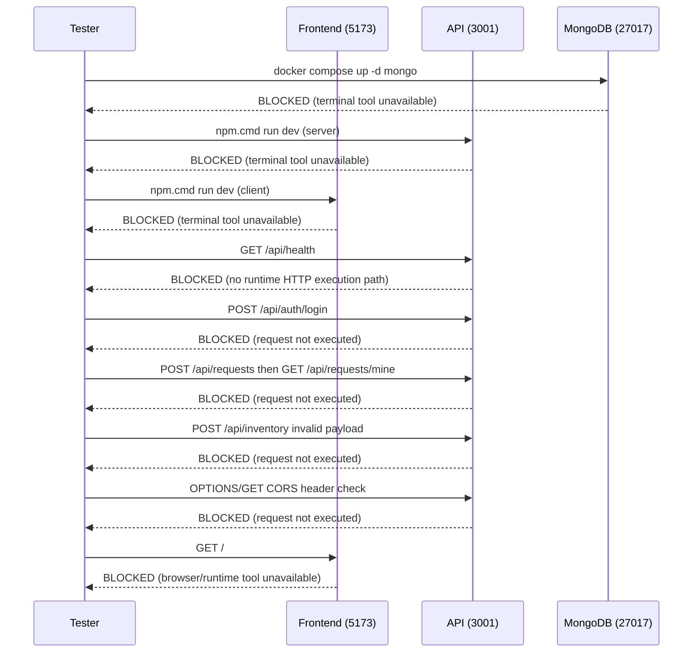

# Integration Test Report - 2026-04-20T00:00:00Z

## Execution Context

- Stage: integration-testing-agent
- Workspace: `c:\Users\PrakhyaNagaKrishnaSa\Desktop\genAi-khata\office-supply-ms`
- OS: Windows
- Runtime status: terminal and browser execution channels were unavailable in this session, so live process startup and HTTP/browser checks could not execute.

## Stack Detected

- Backend: Node.js + Express (TypeScript), expected port `3001`
- Frontend: React + Vite, expected port `5173`
- Database: MongoDB (Docker Compose service `mongo`), expected port `27017`

## Exact Command List And Outcomes

| Command | Outcome | Evidence Summary |
|---|---|---|
| `cd c:\Users\PrakhyaNagaKrishnaSa\Desktop\genAi-khata\office-supply-ms` | FAILED | Terminal execution channel unavailable |
| `docker compose up -d mongo` | FAILED | Terminal execution channel unavailable |
| `docker-compose up -d mongo` (fallback) | FAILED | Terminal execution channel unavailable |
| `cd c:\Users\PrakhyaNagaKrishnaSa\Desktop\genAi-khata\office-supply-ms\server && npm.cmd install` | FAILED | Terminal execution channel unavailable |
| `cd c:\Users\PrakhyaNagaKrishnaSa\Desktop\genAi-khata\office-supply-ms\server && npm.cmd run dev` | FAILED | Terminal execution channel unavailable |
| `GET http://localhost:3001/api/health` | FAILED | Runtime HTTP execution path unavailable |
| `POST http://localhost:3001/api/auth/login` | FAILED | Runtime HTTP execution path unavailable |
| `GET http://localhost:3001/api/dashboard` (Bearer token) | FAILED | Runtime HTTP execution path unavailable |
| `POST http://localhost:3001/api/requests` then `GET http://localhost:3001/api/requests/mine` | FAILED | Runtime HTTP execution path unavailable |
| `POST http://localhost:3001/api/inventory` (invalid payload) | FAILED | Runtime HTTP execution path unavailable |
| `OPTIONS/GET http://localhost:3001/api/health` (CORS header check) | FAILED | Runtime HTTP execution path unavailable |
| `cd c:\Users\PrakhyaNagaKrishnaSa\Desktop\genAi-khata\office-supply-ms\client && npm.cmd install` | FAILED | Terminal execution channel unavailable |
| `cd c:\Users\PrakhyaNagaKrishnaSa\Desktop\genAi-khata\office-supply-ms\client && npm.cmd run dev` | FAILED | Terminal execution channel unavailable |
| `GET http://localhost:5173` | FAILED | Browser/runtime execution channel unavailable |
| Cleanup (`docker compose down`, process stop) | NOT REQUIRED | No background processes or containers were started |

## Integration Checks

| Check | Result | Notes |
|---|---|---|
| Backend starts clean | BLOCKER | Could not start server process or read startup output |
| Database connectivity | BLOCKER | Could not start MongoDB service or verify DB-backed endpoint |
| Auth flow | BLOCKER | Could not execute login + protected endpoint requests |
| Cross-module data flow | BLOCKER | Could not execute POST then GET consistency requests |
| Error propagation | BLOCKER | Could not execute invalid-input request to confirm 400/422 behavior |
| CORS headers | BLOCKER | Could not inspect runtime response headers |
| Frontend loads | BLOCKER | Could not start frontend process or verify page render |

## Blocker Evidence

1. Runtime startup execution unavailable
	- Endpoint/step: `docker compose`, `npm.cmd run dev` for server/client
	- Expected: successful process startup logs and listening ports
	- Actual: commands could not run in this session
	- Diagnosis: terminal execution channel unavailable

2. Backend health request unavailable
	- Endpoint/step: `GET http://localhost:3001/api/health`
	- Expected: `200` with health JSON payload
	- Actual: request not executed
	- Diagnosis: HTTP execution path unavailable without runtime tool access

3. Frontend runtime verification unavailable
	- Endpoint/step: `GET http://localhost:5173`
	- Expected: rendered HTML page from Vite app
	- Actual: request not executed
	- Diagnosis: browser/runtime execution channel unavailable

## Verified Call Flow

## Gate Decision

**FAIL** - Do not enter formal testing from this run because no live integration evidence could be collected.

Rerun integration-testing in a session with terminal and browser execution enabled; then replace this report with real startup logs, status codes, response bodies, and header evidence.